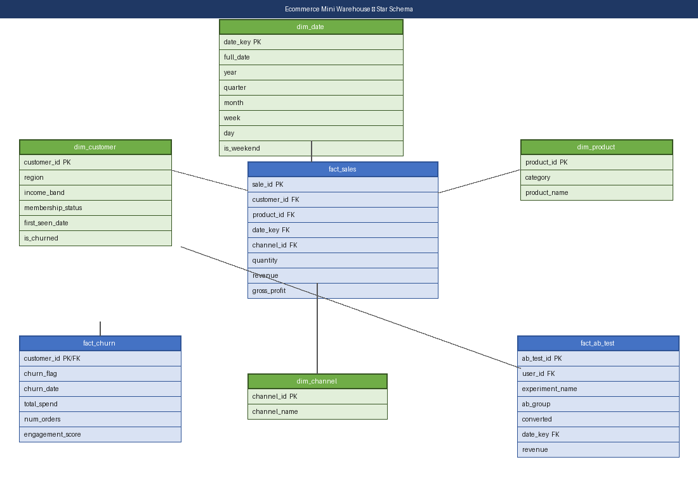

# E-commerce Analytics Mini Data Warehouse (PostgreSQL)

This project builds a small **star schema data warehouse** in PostgreSQL to support analytics across e-commerce sales, customer churn, and A/B testing experiments. It demonstrates schema design, ETL processes, data quality checks, and analytics querying.

---

## Business context

The warehouse consolidates three datasets:
- **Retail sales transactions** (revenue, COGS, profitability by product/channel)
- **Customer churn records** (demographics, spending behavior, churn flags)
- **A/B test results** (landing page experiments)

---

## Folder Structure

```
Ecommerce_Mini_Warehouse_Postgres/
├── data/
│   ├── sales_raw.csv         # Retail transaction data
│   ├── churn_raw.csv         # Customer churn attributes & labels
│   └── ab_test_raw.csv       # A/B experiment results
├── sql/
│   ├── 01_schema_ddl.sql          # Create dimension & fact tables
│   ├── 02_staging_tables.sql      # Raw landing (staging) tables + COPY commands
│   ├── 03_etl_insert_dim_fact.sql # Transform staging → warehouse
│   ├── 04_quality_checks.sql      # Referential integrity & business-rule checks
│   └── 05_sample_analytics.sql   # Sample analytical queries
├── notebooks/
│   └── 01_etl_and_quality_checks.ipynb  # End-to-end ETL + QC in Python
├── tests/
│   └── test_warehouse.py     # Automated pytest suite (24 tests)
├── diagrams/
│   └── ecommerce_star_schema.png    # ERD / star-schema diagram
└── README.md
```

---

## Star Schema



### Dimension Tables

| Table | Key columns |
|-------|-------------|
| `dim_customer` | `customer_id`, `region`, `income_band`, `membership_status`, `first_seen_date`, `is_churned` |
| `dim_product`  | `product_id`, `category`, `product_name` |
| `dim_date`     | `date_key` (YYYYMMDD int), `full_date`, `year`, `quarter`, `month`, `week`, `day`, `is_weekend` |
| `dim_channel`  | `channel_id`, `channel_name` |

### Fact Tables

| Table | Grain | Key measures |
|-------|-------|-------------|
| `fact_sales`   | One row per transaction | `quantity`, `revenue`, `gross_profit` |
| `fact_churn`   | One row per customer    | `churn_flag`, `total_spend`, `engagement_score` |
| `fact_ab_test` | One row per experiment participant | `converted`, `revenue` |

**Key design principles:**
- Primary/foreign key relationships for referential integrity
- Data types optimized for analytics (`NUMERIC` for money, `DATE` for time)
- `CHECK` constraints to enforce business rules (e.g., non-negative quantities)

---

## ETL process

1. **Staging:** Raw CSVs land in `staging.*` tables via `\COPY` (no validation).
2. **Dimension loading:** `INSERT … ON CONFLICT DO UPDATE` into `dw.dim_*` tables with business rules applied (e.g., income band normalisation, `is_churned` flag).
3. **Fact loading:** `INSERT … SELECT` joins staging to dimensions, applying type casts and NULL handling.
4. **Quality checks:** Referential integrity, business rules, and aggregation consistency validated in `04_quality_checks.sql`.

---

## Data quality results

| Table name      |    Rows | Issues |
|-----------------|--------:|--------|
| dim_customer    |  5,000+ | 0      |
| dim_product     |    25+  | 0      |
| dim_date        |  4,018  | 0      |
| dim_channel     |      3+ | 0      |
| fact_sales      | 17,000+ | 0      |
| fact_churn      |  9,000  | 0      |
| fact_ab_test    |290,000+ | 0      |

---

## Quick Start

### 1 — Create & connect to the database

```bash
createdb ecommerce_warehouse
psql -d ecommerce_warehouse
```

### 2 — Run SQL scripts in order

```sql
\i sql/01_schema_ddl.sql
\i sql/02_staging_tables.sql

-- Load CSVs (run from the project root)
\COPY staging.stg_sales   FROM 'data/sales_raw.csv'   WITH (FORMAT CSV, HEADER TRUE);
\COPY staging.stg_churn   FROM 'data/churn_raw.csv'   WITH (FORMAT CSV, HEADER TRUE);
\COPY staging.stg_ab_test FROM 'data/ab_test_raw.csv' WITH (FORMAT CSV, HEADER TRUE);

\i sql/03_etl_insert_dim_fact.sql
\i sql/04_quality_checks.sql
```

### 3 — Or run everything from the Jupyter notebook

```bash
pip install sqlalchemy psycopg2-binary pandas jupyter

# Set connection env vars (defaults: postgres/postgres on localhost:5432)
export PG_USER=postgres
export PG_PASSWORD=your_password

jupyter notebook notebooks/01_etl_and_quality_checks.ipynb
```

### 4 — Run the automated test suite

```bash
pip install pytest psycopg2-binary sqlalchemy pandas

# Optional: set connection env vars (same defaults as above)
export PG_USER=postgres
export PG_PASSWORD=your_password

# From the Ecommerce_Mini_Warehouse_Postgres/ directory:
pytest tests/test_warehouse.py -v
```

The suite builds a temporary database (`ecommerce_warehouse_test`), runs the
full pipeline, and validates 24 checks covering row counts, referential
integrity, business rules, and aggregate sanity.  It drops the database on
completion.

---

## Data Quality Checks (`04_quality_checks.sql`)

| Category | Checks performed |
|----------|-----------------|
| Row counts | Summary count for every table |
| Referential integrity | Orphan FK rows across all fact tables |
| NULL checks | Critical NOT-NULL columns in dims & facts |
| Business rules | Negative revenue, invalid `income_band`, invalid `ab_group`, mismatched `churn_date` |
| Duplicates | Duplicate PKs in dimension tables |
| Aggregates | Revenue by channel · Churn rate by region · A/B conversion rates |

---

## Sample Analytical Queries

**Revenue by channel and month** (`05_sample_analytics.sql` query 1):

```sql
SELECT dd.year, dd.month, TRIM(dd.month_name) AS month_name,
       dc.channel_name, SUM(fs.revenue) AS total_revenue
FROM dw.fact_sales fs
JOIN dw.dim_date    dd ON fs.date_key   = dd.date_key
JOIN dw.dim_channel dc ON fs.channel_id = dc.channel_id
GROUP BY dd.year, dd.month, dd.month_name, dc.channel_name
ORDER BY dd.year, dd.month, dc.channel_name;
```

**Churn rate by membership status** (`05_sample_analytics.sql` query 2):

```sql
SELECT dc.membership_status,
       COUNT(fc.customer_id) AS customer_count,
       ROUND(SUM(CASE WHEN fc.churn_flag THEN 1 ELSE 0 END)::NUMERIC / COUNT(*), 4) AS churn_rate,
       ROUND(AVG(fc.total_spend), 2) AS avg_total_spend
FROM dw.fact_churn   fc
JOIN dw.dim_customer dc ON fc.customer_id = dc.customer_id
GROUP BY dc.membership_status
ORDER BY churn_rate DESC;
```

**A/B test conversion rates** (`05_sample_analytics.sql` query 4):

```sql
SELECT de.experiment_name, fat.group_name,
       COUNT(fat.ab_test_id) AS test_users,
       ROUND(SUM(CASE WHEN fat.converted THEN 1 ELSE 0 END)::NUMERIC / COUNT(*), 4) AS conversion_rate
FROM dw.fact_ab_test   fat
JOIN dw.dim_experiment de ON fat.experiment_id = de.experiment_id
GROUP BY de.experiment_name, fat.group_name
ORDER BY de.experiment_name, fat.group_name;
```

---

## Requirements

| Tool | Version |
|------|---------|
| PostgreSQL | ≥ 13 |
| Python | ≥ 3.9 |
| pandas | ≥ 1.5 |
| SQLAlchemy | ≥ 2.0 |
| psycopg2-binary | ≥ 2.9 |
| jupyter | any recent |

---

## Skills demonstrated

- **Data modeling** – star schema design with proper primary/foreign keys and relationships
- **ETL development** – SQL-based transform and load processes with idempotent upserts
- **Data quality** – referential integrity checks, business rule validation, duplicate detection
- **Analytics readiness** – tables optimized for revenue, churn, and experiment analysis
- **Test automation** – 24‑check pytest suite covering row counts, integrity, business rules, and aggregates

This warehouse structure supports analytics projects such as RFM segmentation, churn prediction, A/B testing, and retail KPI dashboards.
